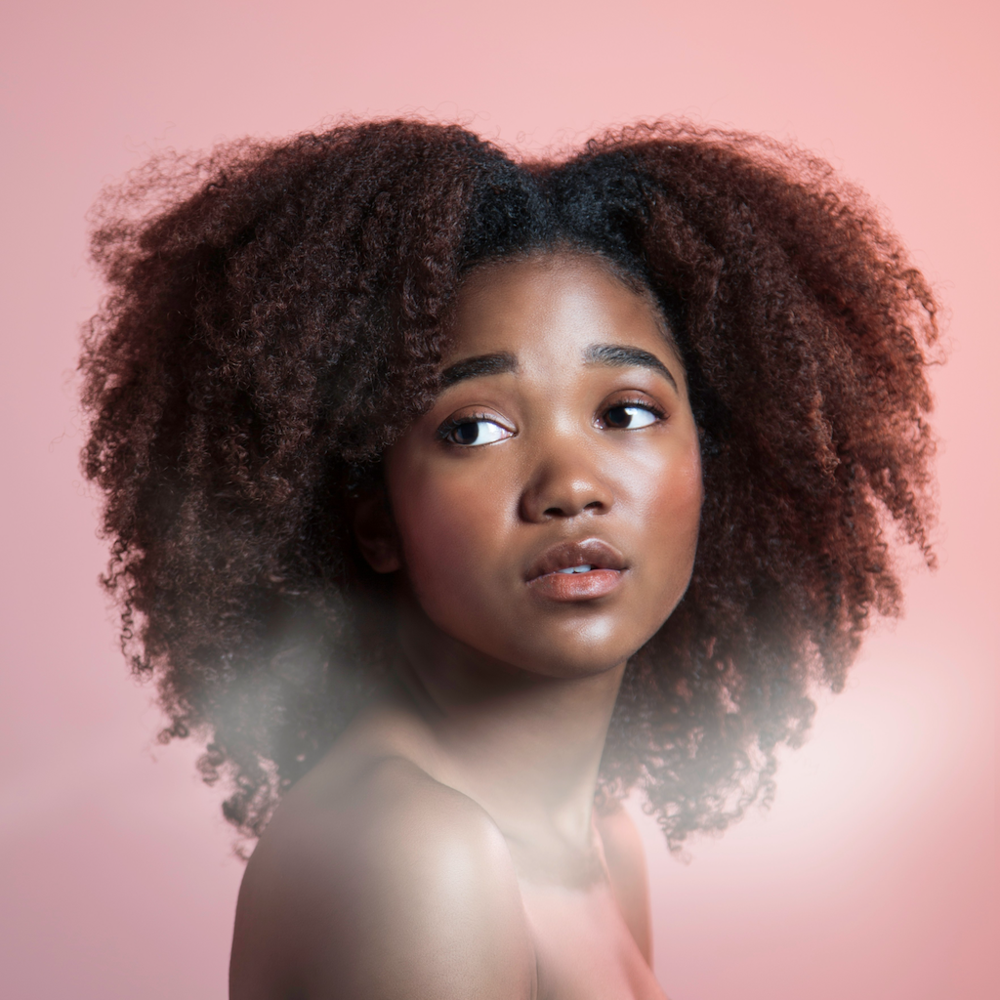
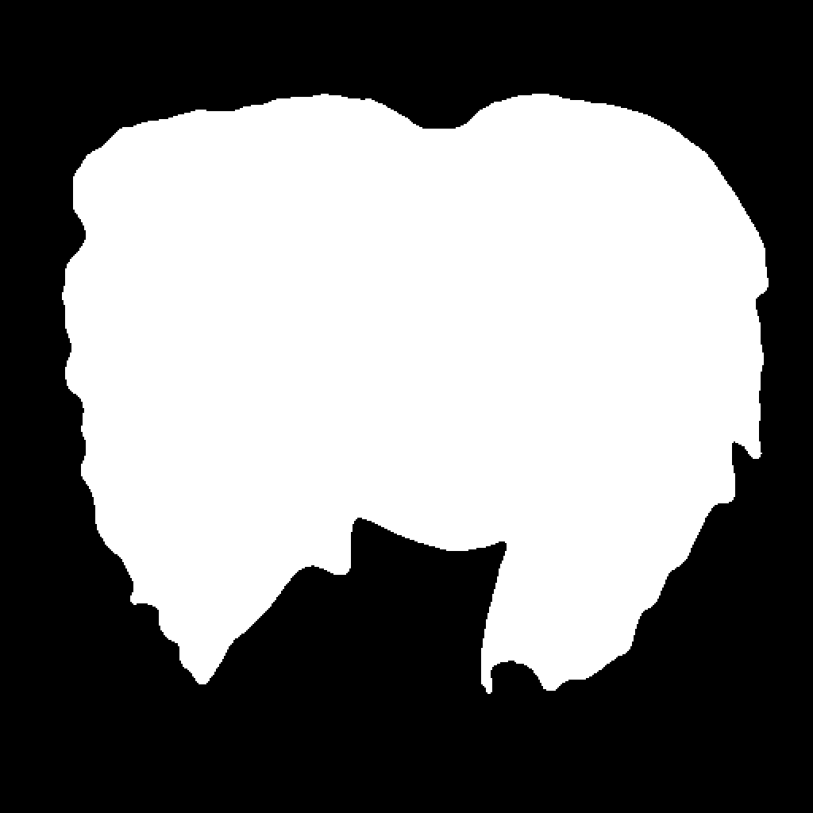

# Head Segmentation

<div align="center">
A lightweight implementation for head segmentation<br>
</div>

## Description

This project provides a simple implementation of head segmentation, utilizing the pre-trained model and interface from [wiktorlazarski's head-segmentation project](https://github.com/wiktorlazarski/head-segmentation). The model is specifically trained to generate masks for heads, including hair, which is very helpful for various data preparation scenarios.

While this project may not produce perfect segmentation results, it provides a good starting point for further refinement. 

## Example

| Original Image | Generated Mask |
|----------------|----------------|
|  |  |

In this example, we segment the head from the image using the provided model.

Photo credit: Photo by <a href="https://unsplash.com/@dolfoto?utm_content=creditCopyText&utm_medium=referral&utm_source=unsplash">Rodolfo Mari</a> on <a href="https://unsplash.com/photos/red-radio-flyer-trike-on-brown-dried-leaves-2sNnC0zDOBQ?utm_content=creditCopyText&utm_medium=referral&utm_source=unsplash">Unsplash</a>

## Installation

1. Install the head-segmentation package:
```bash
pip install git+https://github.com/wiktorlazarski/head-segmentation.git
```

2. Install additional requirements for this project:
```bash
pip install -r requirements.txt
```

## Usage

### Command Line Interface

You can use the script directly from the command line:

```bash
python head_segmentation.py --image_path path/to/image.png --output_path path/to/mask.png
```

### Integration in Your Code

You can use the `HumanHeadSegmentationPipeline` class in your Python code:

```python
from head_segmentation import HumanHeadSegmentationPipeline
# Initialize the segmentation pipeline
pipeline = HumanHeadSegmentationPipeline("okaris/head-segmentation")

# Load your image
image = Image.open("path/to/image.png")

# Perform segmentation
mask = pipeline(image)

# Save or process the segmentation map as needed
mask.save("path/to/mask.png")
```

## Input Formats

- `PIL.Image.Image` (3 channel input image)

## Output Format

- `PIL.Image.Image` (binary mask where whites indicates head region)

## Notes

- The script automatically uses CUDA if available, otherwise it falls back to CPU.
- For visualization and additional processing, refer to the [original repository](https://github.com/wiktorlazarski/head-segmentation) for more detailed examples.

## Credits

This project is based on the work done by [wiktorlazarski](https://github.com/wiktorlazarski) in the [head-segmentation](https://github.com/wiktorlazarski/head-segmentation) repository. We are grateful for their efforts in creating and training the model.

## Sources

[1] wiktorlazarski. (2023). head-segmentation. GitHub. https://github.com/wiktorlazarski/head-segmentation  
